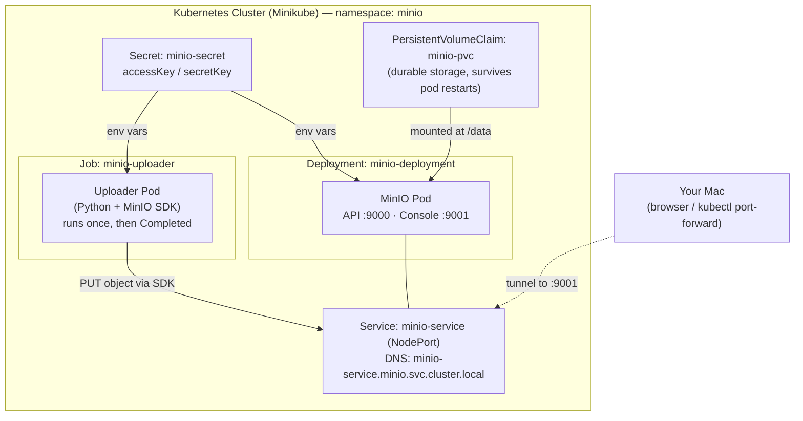

# MinIO on Kubernetes — Object Storage with a Containerized Python Uploader

A hands-on project that runs [MinIO](https://min.io) (an S3-compatible object store) inside a
Kubernetes cluster (Minikube), and uploads a file to it using a Python application that is itself
containerized and deployed into the same cluster as a Kubernetes **Job**.

The project was built by walking up the stack — from a local Docker container, to the Python SDK,
to a full Kubernetes deployment — so each layer builds on the last.

---

## What this project demonstrates

- Running MinIO as a Kubernetes **Deployment**
- Storing credentials as a Kubernetes **Secret** (kept out of source control)
- Persisting data across pod restarts with a **PersistentVolumeClaim (PVC)**
- Exposing MinIO through a **Service**
- Containerizing a Python app with a **Dockerfile**
- Running that app as a one-shot **Job** that talks to MinIO over **internal cluster DNS**
- Injecting the same Secret into the app so credentials live in exactly one place

---

## Architecture



### How a request flows

1. The **uploader Job** starts a pod running the containerized Python app.
2. The app reads its endpoint and credentials from **environment variables**, injected from the
   **Secret** and pointed at the MinIO **Service DNS name**.
3. It connects to MinIO through the **Service**, creates a bucket if needed, and uploads a file.
4. MinIO writes the object to storage backed by the **PVC**, so it survives pod restarts.
5. From your Mac, you reach the **console** via `kubectl port-forward` and verify the file landed.

---

## Components

| Resource | Kind | Purpose |
|---|---|---|
| `minio` | Namespace | Isolates all project resources from the rest of the cluster |
| `minio-secret` | Secret | Holds `accessKey` / `secretKey`, referenced by both MinIO and the uploader |
| `minio-pvc` | PersistentVolumeClaim | Durable storage for `/data` so objects survive pod restarts |
| `minio-deployment` | Deployment | Runs the MinIO server (long-lived) |
| `minio-service` | Service (NodePort) | Stable in-cluster address + external access to API (9000) and console (9001) |
| `minio-uploader` | Job | Runs the Python uploader once to completion, then stops |

### Why a Job (not a Deployment) for the uploader

The uploader does a task and **exits**. A Deployment expects processes to run *forever* and would
restart the app after every successful exit, causing a crash loop. A **Job** runs a pod until it
completes successfully, then stops — which matches a one-shot upload.

- Runs forever (server) → **Deployment**
- Runs a task and exits → **Job**
- Runs on a schedule → **CronJob**

---

## Project structure

```
.
├── README.md
├── docker-compose.yml     # (earlier stage) MinIO via Docker Compose
├── Dockerfile             # packages the Python uploader into an image
├── .dockerignore          # keeps .env / venv out of the image
├── requirements.txt       # Python dependencies (minio, python-dotenv)
├── file_uploader.py       # the uploader app
├── k8s/
│   ├── pvc.yaml           # PersistentVolumeClaim
│   ├── deployment.yaml    # MinIO Deployment + Service
│   └── job.yaml           # uploader Job
└── .env                   # local-only credentials (NEVER committed)
```

---

## Prerequisites

Docker · Minikube · `kubectl` · Python 3.7+ (only needed to run the uploader locally)

---

## Walkthrough

The project was built in four stages, each preparing the next.

### Stage 1 — MinIO locally with Docker Compose

Get MinIO running on its own first. `docker-compose.yml` defines the `minio/minio` service,
exposes port `9000` (the S3 API) and `9001` (the web console), maps a local folder as a volume so
data persists, and supplies root credentials via environment variables (kept in a gitignored
`.env`, referenced with `${...}` interpolation rather than hardcoded).

```bash
docker compose up -d
```

The console is then reachable at `http://localhost:9001`. This stage proves MinIO works and
introduces the config-not-code habit used everywhere later.

### Stage 2 — Talking to MinIO from Python

Set up an isolated Python environment and install the client:

```bash
python3 -m venv venv
source venv/bin/activate
pip3 install minio python-dotenv
pip3 freeze > requirements.txt
```

`file_uploader.py` creates a MinIO client, checks whether the target bucket exists (creating it only
if missing, so the script is safe to re-run), and uploads a local file into it. Credentials and the
endpoint are read from a `.env` file — never hardcoded, never committed.

Two things that matter for a local server:

- **`secure=False`** — the client assumes HTTPS by default, but a local MinIO serves plain HTTP.
  Without this you get an SSL `WRONG_VERSION_NUMBER` error.
- **`.env` values are strings**, so `"False"` is converted to a real boolean in code before being
  passed to the client.

### Stage 3 — MinIO on Kubernetes (Minikube)

Everything from Stage 1 is re-expressed as Kubernetes resources.

- **Namespace** — a dedicated `minio` namespace isolates the project.
- **Secret** (`minio-secret`) — holds the credentials so they never appear in YAML. (A Secret is
  base64-encoded, not encrypted at rest by default — its value is decoupling credentials from
  manifests, not hiding them from a cluster admin.)
- **PVC** (`minio-pvc`) — requests durable storage. On Minikube the default StorageClass
  provisions a matching volume automatically. This is what makes data survive pod restarts, unlike
  the ephemeral `emptyDir` it replaced.
- **Deployment** (`minio-deployment`) — runs the MinIO server, pulls its root credentials from the
  Secret, and mounts the PVC at `/data`.
- **Service** (`minio-service`) — gives MinIO a stable address inside the cluster and exposes both
  the API (9000) and console (9001).

```bash
kubectl create namespace minio
kubectl create secret generic minio-secret -n minio \
  --from-literal=accessKey=<your-access-key> \
  --from-literal=secretKey=<your-secret-key>
kubectl apply -f k8s/pvc.yaml
kubectl apply -f k8s/deployment.yaml
kubectl get pvc -n minio    # expect STATUS: Bound
kubectl get pods -n minio   # expect the MinIO pod Running
```

Kubernetes wires resources together by **exact name matching**: the Service `selector` must match
the pod `labels`, and the container's `volumeMounts` name must match the pod's `volumes` name.

### Stage 4 — Containerize the uploader and run it as a Job

The Python app can't run in Kubernetes as a loose script — it has to be a container image.

- **Dockerfile** — starts from a slim Python base, installs dependencies *before* copying the code
  (so Docker caches the dependency layer across code changes), copies the app in, and bakes in a
  sample file to upload.
- **`.dockerignore`** — ensures `.env`, `venv/`, and caches never end up inside the image.

Build the image and make it available to Minikube — which runs its **own** Docker environment
separate from your Mac, so the image must be explicitly loaded in:

```bash
docker build -t my-uploader:latest .
minikube image load my-uploader:latest
minikube image ls | grep uploader   # confirm it's present
```

The **Job** (`job.yaml`) runs the image once. Two things change from the local setup:

- The endpoint is the **internal Service DNS name** (`minio-service.minio.svc.cluster.local:9000`),
  because the app now runs *inside* the cluster network — no tunnel needed.
- Credentials come from the **same Secret** MinIO uses, so there's one source of truth. `.env` is
  never baked into the image.

```bash
kubectl apply -f k8s/job.yaml
kubectl get pods -n minio -w        # watch for the uploader pod to reach Completed
kubectl logs -n minio job/minio-uploader
```

A healthy run shows the pod go `Running → Completed` with 0 restarts, and the logs print the bucket
message plus the upload confirmation.

---

## Verifying the upload in the console

```bash
kubectl port-forward -n minio service/minio-service 9001:9001
```

Open `http://localhost:9001`, log in, and look in **`test-bucket`** for **`test.txt`**. The tunnel
only lives while the command runs.

---

## Common errors and what they mean

| Error | Meaning | Fix |
|---|---|---|
| `SSL: WRONG_VERSION_NUMBER` | Client tried HTTPS against a plain-HTTP server | Set `secure=False` |
| `no matches for kind "..."` / `ensure CRDs are installed` | Misspelled `kind` or wrong `apiVersion` on a built-in resource | Fix the spelling / API group (`Deployment` → `apps/v1`) |
| `unknown field "spec.X.Y"` | A YAML block is at the wrong indentation depth | Read the dotted path — it names where the block landed vs. where it belongs |
| `ErrImageNeverPull` | `imagePullPolicy: Never` and the image isn't present locally | Load the image / fix the image name to match exactly |
| `ImagePullBackOff` | Tried to pull from a registry and failed | Check registry path / credentials |
| `FileNotFoundError` inside the pod | Host files don't exist in the container's isolated filesystem | Bake the file into the image (or mount it) |
| Job updates ignored on re-apply | A Job's pod template is immutable | `kubectl delete job` then `kubectl apply` |

---

## Gotchas worth remembering

- **Rebuild + reload are a pair.** After changing the image, run both `docker build` *and*
  `minikube image load`. The unchanged `:latest` tag hides a stale cached image.
- **Two Docker environments.** Your Mac's Docker and Minikube's Docker are separate; an image built
  on the host isn't visible to the cluster until loaded in.
- **Same namespace matters.** The short Service DNS name and the Secret reference both resolve
  within the Job's namespace — keep the Job in `minio`.
- **Names must match exactly.** Service selector ↔ pod labels, `volumeMounts` ↔ `volumes`, manifest
  image name ↔ loaded image. `-` vs `_` counts.
- **Secrets never get committed.** `.env`, real credentials, and data files stay out of git and out
  of images. The cluster injects credentials at runtime from the Secret.

---

## Cleanup

```bash
kubectl delete job minio-uploader -n minio
kubectl delete -f k8s/deployment.yaml
kubectl delete -f k8s/pvc.yaml
kubectl delete secret minio-secret -n minio
kubectl delete namespace minio
```
